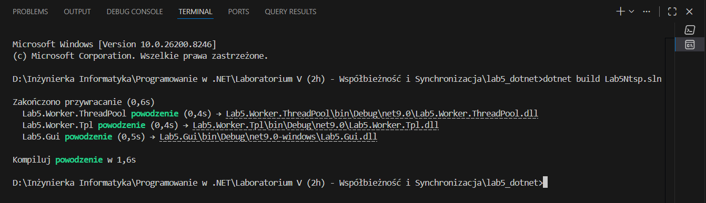
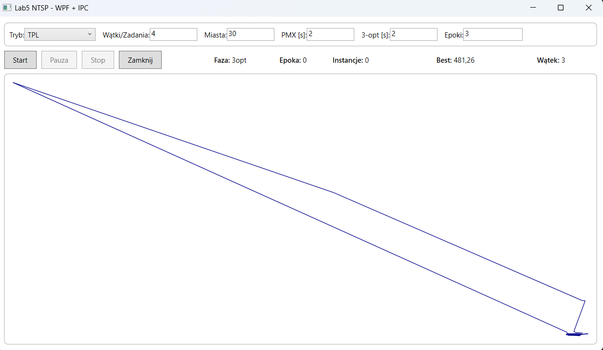
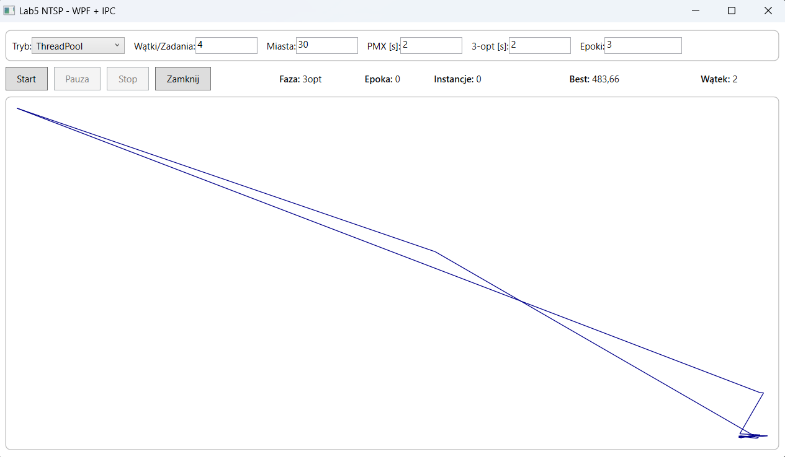

# Autor:
Adam Sieheń

Nr albumu: 38242

ININ4(hybryda) PR1.1 (dla różnic programowych)

RealRP – Programowanie .NET – z_sem3_TGoluch 

# Lab5 NTSP (.NET)
Implementacja wariantu podstawowego zadania:
- GUI w WPF (`Lab5.Gui`)
- 2 procesy obliczeniowe:
  - `Lab5.Worker.Tpl` (Task Parallel Library)
  - `Lab5.Worker.ThreadPool` (ThreadPool/QueueUserWorkItem)
- Kod współdzielony (`Lab5.Shared`) w formie Shared Project z parserem TSP, PMX, lokalnym 3-opt, helperami workerów i kontraktami IPC.

## Uruchamianie

1. Zbuduj rozwiązanie:

```powershell
dotnet build Lab5Ntsp.sln
```



2. Uruchom GUI:

```powershell
dotnet run --project Lab5.Gui/Lab5.Gui.csproj
```

3. W GUI ustaw:
- tryb: `TPL` albo `ThreadPool`
- liczbę zadań/wątków
- liczbę miast wczytywanych z `data/contries.tsp` (praktycznie zaczynaj od małej wartości)
- czasy faz PMX i 3-opt
- liczbę epok

4. Kliknij `Start`, następnie `Pauza/Wznów` lub `Stop`.




## Komunikacja

GUI komunikuje się z workerami przez Named Pipes i odbiera:
- status fazy i epoki,
- licznik przetworzonych instancji,
- najlepszą aktualną długość trasy,
- identyfikator wątku/zadania,
- aktualną najlepszą trasę do wizualizacji.

## Struktura projektu

- `Lab5.Gui` — główny projekt WPF odpowiedzialny za interfejs użytkownika.
  - [Lab5.Gui/MainWindow.xaml](Lab5.Gui/MainWindow.xaml) — definicja okna i kontrolek.
  - [Lab5.Gui/MainWindow.xaml.cs](Lab5.Gui/MainWindow.xaml.cs) — obsługa parametrów, sterowanie przyciskami i rysowanie trasy.
  - [Lab5.Gui/WorkerClient.cs](Lab5.Gui/WorkerClient.cs) — uruchamianie procesu workera i komunikacja przez Named Pipes.
- `Lab5.Worker.Tpl` — proces obliczeniowy wykorzystujący Task Parallel Library.
  - [Lab5.Worker.Tpl/Program.cs](Lab5.Worker.Tpl/Program.cs) — punkt wejścia procesu.
  - [Lab5.Worker.Tpl/TplWorkerEngine.cs](Lab5.Worker.Tpl/TplWorkerEngine.cs) — logika obliczeń równoległych dla wariantu TPL.
- `Lab5.Worker.ThreadPool` — proces obliczeniowy wykorzystujący `ThreadPool`.
  - [Lab5.Worker.ThreadPool/Program.cs](Lab5.Worker.ThreadPool/Program.cs) — punkt wejścia procesu.
  - [Lab5.Worker.ThreadPool/ThreadPoolWorkerEngine.cs](Lab5.Worker.ThreadPool/ThreadPoolWorkerEngine.cs) — logika obliczeń równoległych dla wariantu ThreadPool.
- `Lab5.Shared` — wspólny kod dołączany do wszystkich projektów przez Shared Project.
  - [Lab5.Shared/Lab5.Shared.projitems](Lab5.Shared/Lab5.Shared.projitems) — lista plików linkowanych do projektów.
  - [Lab5.Shared/Models.cs](Lab5.Shared/Models.cs) — modele danych i ustawień uruchomienia.
  - [Lab5.Shared/IpcContracts.cs](Lab5.Shared/IpcContracts.cs) — kontrakty komunikatów IPC.
  - [Lab5.Shared/TspLoader.cs](Lab5.Shared/TspLoader.cs) — parser danych TSP.
  - [Lab5.Shared/RouteMath.cs](Lab5.Shared/RouteMath.cs) — operacje na trasach i obliczanie długości cyklu.
  - [Lab5.Shared/GeneticOperators.cs](Lab5.Shared/GeneticOperators.cs) — implementacja PMX i 3-opt.
  - [Lab5.Shared/GlobalBestStore.cs](Lab5.Shared/GlobalBestStore.cs) — współdzielony magazyn najlepszego rozwiązania.
  - [Lab5.Shared/ProcessedCounter.cs](Lab5.Shared/ProcessedCounter.cs) — licznik przetworzonych kandydatów.
  - [Lab5.Shared/ProjectPaths.cs](Lab5.Shared/ProjectPaths.cs) — wspólne ścieżki do solution i pliku danych.
  - [Lab5.Shared/WorkerServerHost.cs](Lab5.Shared/WorkerServerHost.cs) — wspólny host workera odbierający komendy `start`, `pause`, `resume`, `stop`.
  - [Lab5.Shared/WorkerEngineSupport.cs](Lab5.Shared/WorkerEngineSupport.cs) — wspólne helpery dla obu silników obliczeniowych.

## Uwagi

- Zaimplementowano wariant podstawowy z PMX i 3-opt.
- Opcjonalny alternatywny operator krzyżowania z artykułu nie jest użyty.
